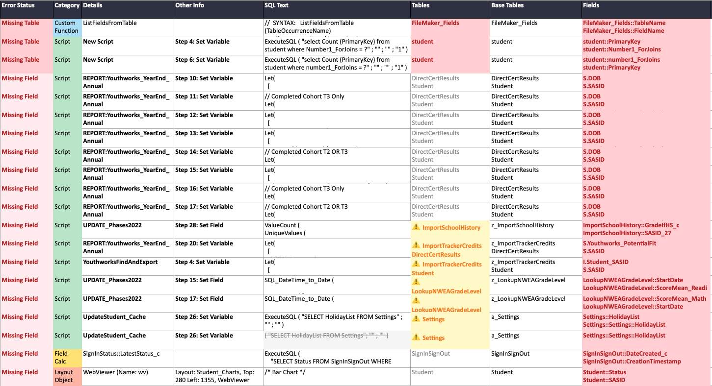

# FileMaker-DDR-Checker
This main purpose of this script is to find all unused layouts, scripts, fields, tables, and relationships. It will also detect broken ExecuteSQL statements. 

# Installation
Download Python files and run the main file. 
It will ask for you to find an XML of your DDR file.

# Known Issues
* Filemaker chokes on many emoji, esp any more complex ones that use a Zero-Width Joiner (ZWJ). For example: 👨 + ZWJ + 👩 + ZWJ + 👧 = 👨‍👩‍👧 (family). Because of this I just convert all emoji to +
* This is very much pre-beta

# Definitions and Notes
* TOCs = Table Occurances in the relationship graph
* I've never programmed in Python. This was mostly written by an AI. 🤷‍♂️
* This is something I put together for my own use, but hopefully will help others.
* Emoji’s remain problematic. Filemaker sometimes turns them into ??, I change that to * when parsing for various reasons I no longer remember
* In some cases I was suspicious of the counts that python created, so some results show a XML count, in these cases Python does a straight up occurrence count of that item name, which may give some skewed results if (for example) you have fields with the same name (i.e. if three tables have a field called Count_s the XML count will be unrealistic.
* -debug mode will leave up debug info in terminal
* -cache mode will save the data that's being passed to the various checks, including the XML file that's updated with emoji's fixed and other similar issues.

## Odd Choices I've made
Because I wrote this for myself, I've coded in some things that might trip you up. Here's an incomplete list of them, so you're aware. Feel free to adopt any of these or ignore them or comment them out.
* To allow me to make easy SQL calls and still rename my TOCs My database is structured so that every base table has it’s own table in the TOC graph, and then is duplicated and labeled other places.
* Script test:
    * Any script with the word "SERVER" in it gets coded as yellow and grouped together. I use this to denote scripts that run on server or are triggered from the server.
    * If there is script folder called "ToDelete" and make those items yellow. I use this as a staging area where I "age" unused scripts.
    * If there is a script folder caleld "Dev Playground". Any scripts that are in that folder or that say "debug" will be flagged as "debug" and will be yellow, not marked red for deletion. 
* Layouts test:
    * If there is layout folder called "ToDelete" and make those items yellow. I use this as a staging area where I "age" unused layouts.
* Fields test:
    * Tables that include Import start with the word Import and this is used to categorize things. For example “unused fields” will group anything imported separately because we probably don’t want to delete those duplicate fields.
    * I assume all Default system fields (PrimaryKey, ModifiedTimestamp, etc.) should exist, and they're never flagged for deletion
    * Fields which start with # are assumed to be a comment in the table. For example I might have a field named:  “#          Demographics” which breaks up the grouping of my field names. These are also ignored.
* Table test:
    * When looking at tables, if the table name starts with z_ the base table I remove the z_ in the TOC, so I mark them as the same, even though they aren’t actually.
* Custom fields:
    * Nothing Special

# How I use it (in case anyone cares)
* Layouts
    * Create a layout folder called ToDelete
    * Create a folder within it called Delete <currentdate +6 months>
    * Delete any obvious duplicate layouts (i.e. Home copy 4)
    * Delete any backups that are over 6 months old (i.e. Home backup 6/3/2024)
    * Look at list of layouts and move any that Python finds that are unused to this folder
    * Add an OnRecordLoad or OnLayoutEnter script to each of them to send an email letting us know when something loads that shouldn’t.

* Scripts
    * Create a script folder called ToDelete
    * Create a folder within it called Delete <currentdate +6 months>
    * Delete any obvious duplicate scripts (i.e. Startup copy 4)
    * Delete any backups that are over 6 months old (i.e. Startup backup 6/3/2024)
    * Look at list of scripts and move any that Python finds that are unused to this folder
    * Add a script step at the start of each of these scripts to send an email letting us know when something loads that shouldn’t.
    * How to manually check: Search for script name in XML file manually, if there are 2 instances it is not called anywhere.

* Custom Functions
    * Just delete them, if you get an error you can recover from a backup. Record the date that you did the purge somewhere.

* Tables/Table Occurances
    * I mostly use this to hunt up old or duplicate occurances to tidy them up

* Fields
    * IDK - still figuring this out
